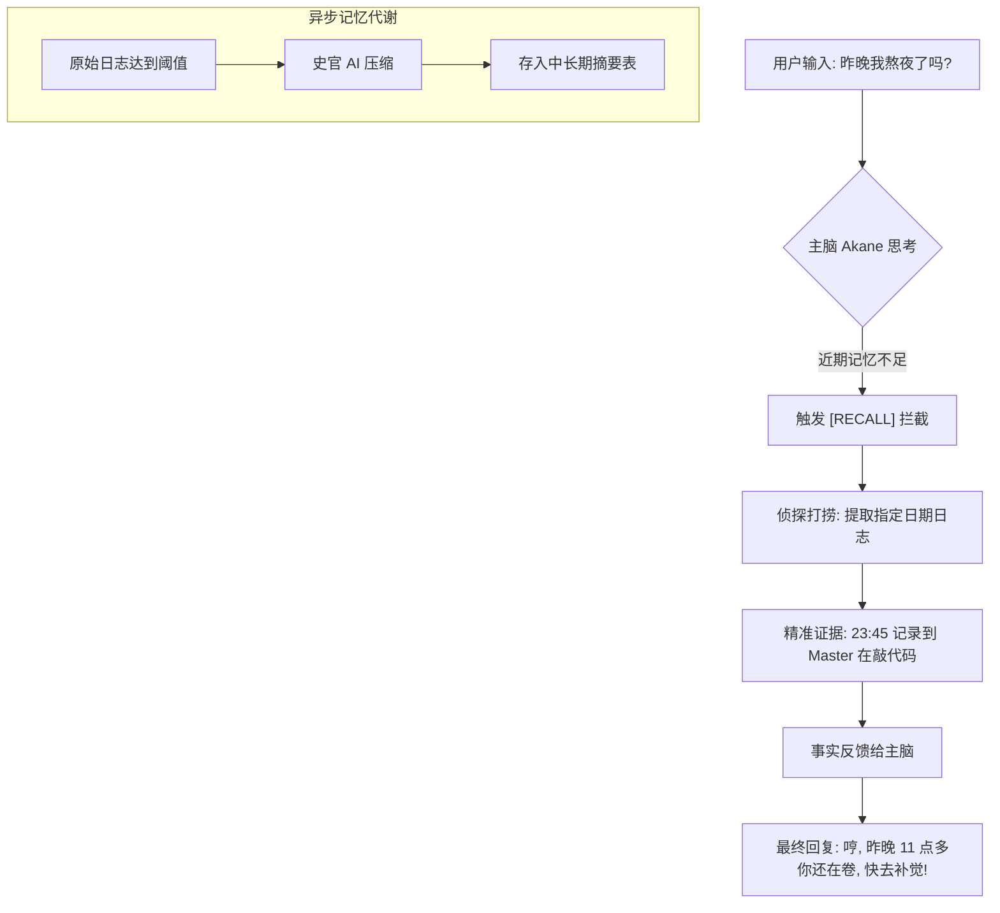

# 【开源】放弃向量数据库：我用极简 SQLite 时间轴，手搓了一个「永不失忆」且带时间感的 AI 记忆引擎

TGMA = Temporal-Grounded Memory Architecture

**时间锚定记忆架构 | 轻量 | 时序正确 | 零幻觉 | 近乎无限记忆**

---

## 🚀 为什么做这个项目？

目前主流 AI Agent 记忆几乎全是向量数据库，但在 **虚拟伴侣、桌面宠物、个人私教、长期陪伴 AI** 场景里，纯向量检索是灾难：

* **时序错乱**：向量只管语义，不管时间，AI 把半年前的事当成昨天。
* **幻觉拼贴**：碎片乱拼，A 事件细节缝到 B 事件上。
* **统计无能**：无法回答「这周我抱怨了几次」「昨天聊了什么」。
* **成本高**：向量库部署、维护、检索都更重。

于是我放弃向量库，只用 **SQLite + 时间轴**，手搓了这套真正像人类一样记忆的引擎。

---

## 🧠 核心三大模块

### 模块一：动态时间标签注入（人类级时间感）

* **不浪费 Token 写死日期**：通过逻辑动态判断。
* **视觉呼吸感**：今天只显示 `[HH:MM]`，往日显示 `[MM-DD HH:MM]`。
* **拟人共情**：AI 能感知节奏、间隔、时差，会记得你多久没理她。

### 模块二：无情史官·降维压缩（防上下文爆炸）

* **自动触发**：达到 30 条记录自动触发后台小模型总结。
* **软着陆衔接**：强制保留最后 2 条记录不压缩，确保对话连续性。
* **时间锚点**：保留“日期+时段”信息，把废话变记忆。

### 模块三：主动打捞·侦探模型（Agentic RAG）

* **主动打捞**：主模型不懂时主动抛出 `[RECALL|日期|问题]`。
* **开卷考试**：侦探模型只读当天原始日志，精准还原真相。
* **零幻觉**：查不到就说不知道，绝不编造。

---

## 🎨 架构逻辑示意图



---

## ⚡ 亮点

* ✅ **只用 SQLite**：无需安装沉重的向量数据库。
* ✅ **时序绝对正确**：基于时间轴打捞，记忆不穿越、不乱序。
* ✅ **零幻觉**：拒绝语义碎片拼贴，每一条回忆都有据可查。
* ✅ **超轻量**：适合桌面宠物、虚拟伴侣、个人 AI，可本地运行。

---

## 🚀 快速运行

```bash
# 1. 安装依赖
pip install -r requirements.txt

# 2. 启动引擎
python tgma_memory_engine.py

```

---

## 💡 适用场景

* 虚拟女友 / 桌面宠物 / AI 陪伴
* 个人私教、学习助手、日记 AI
* 任何需要长期记忆、时间感、真实感的 AI Agent

---

## 作者

由喜欢做桌面宠物的开发者开源，欢迎 Star & Fork & 魔改！

---
